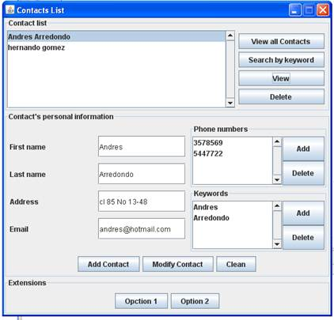

# Description

## Problem Description

The objective is to build an application that handles all the personal contacts for
a user. Each contact has a first and last name, an address, an email, multiple phone
numbers, and a set of keywords used to search for that contact. The first and last
names of the contact must be unique within the list and they are, by default, keywords.

In this application a user must be able to (1) add a new contact , (2) delete an
existing contact, (3) view all the information for a contact, (4) modify a contact's
information, (5) display the entire list of contacts (6) search for contacts using
their keywords.

# Graphical User Interface

